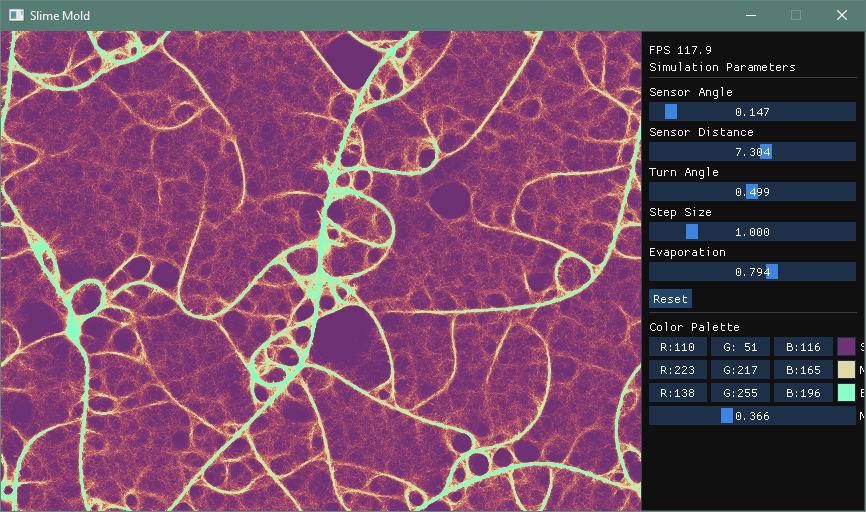

```
 ____  _ _                __  __       _     _ 
/ ___|| (_)_ __ ___   ___|  \/  | ___ | | __| |
\___ \| | | '_ ` _ \ / _ \ |\/| |/ _ \| |/ _` |
 ___) | | | | | | | |  __/ |  | | (_) | | (_| |
|____/|_|_|_| |_| |_|\___|_|  |_|\___/|_|\__,_|
```

This is basically AI generated slime mold simulator. I never used ImGui or SDL libraries, but it evolved this way.
I just randomly asked ChatGPT to create it, use SDL cause I wanted to try it for other project anyways, then it
was upgraded to SDL3 and ImGui was added.

Optimizations were done by me. 

More is in my [blog article](https://www.pavelp.cz/posts/eng-random-chatgpt-code/) with initial, more simple code.



## Build instructions 

Note: as of 2025-08-04 this code uses AVX2 instructions, which is supported by Intel/AMD CPUs from 2015 or so.

### Windows, Conan


* Clone this repo
  ```
  git clone https://github.com/pavel-perina/slime_mold.git
  ```
* Go to project directory
  ```
  cd .\slime_mold\
  ```
* Update submodule (and perform initial fetch - this clones [ImGui](https://github.com/ocornut/imgui) repository)
  ```
  git submodule update --init
  ```
* Install/build dependencies (SDL3) - for some reason you have to run this script after each cleaning of CMake cache as it likely prepares some file for CMake
  ```
  .\conan_install.bat
  ```
  * NOTE: If Conan is not installed, install it using `py -m pip install conan`
  * NOTE: If Python is not in file path, default profile does not exist and remote points to company's repo, this command likely solves everything :-) `C:\Users\[username]\AppData\Local\Programs\Python\Python312\Scripts\conan.exe install . --build=missing -s build_type=RelWithDebInfo --profile:all=custom-msvc2022 --remote=conancenter`
* Open folder in Visual Studio 2022
  * CMake will run automatically
* Choose build type `conan-relwithdebinfo` or `conan-debug`
* Select startup item such as `Relwithdebinfo\slime_mold.exe`
* Build it (build all or just `slime_mold.exe`)
* Debug -> Start (or start without debugging)
* Enjoy :-)

Alternative to running Visual Studio:
* `cmake -S . -B build -DCMAKE_BUILD_TYPE=RelWithDebInfo -DCMAKE_TOOLCHAIN_FILE="build\generators\conan_toolchain.cmake"`
* `.\build\RelWithDebInfo\slime_mold.exe`

### Linux

```sh
# Install package (on Fedora)
sudo dnf install SDL3-devel
# Clone repository
git clone https://github.com/pavel-perina/slime_mold.git
cd slime_mold
# Fetch ImGui submodule
git submodule update --init
# Configure
cmake -S . -B build
# Build using 4 cpu cores
cmake --build build -j 4 --config Release
# Run
build/apps/sdl/slime_mold
```

### Linux, emscripten

```sh
# Set environment (once per shell session)
source ~/emsdk/emsdk_env.sh
emcmake cmake -S . -B build-emscripten -DCMAKE_BUILD_TYPE=Release
cmake --build build-emscripten --config Release
python -m http.server --bind "::" 9000 -d build-emscripten/apps/sdl
```

